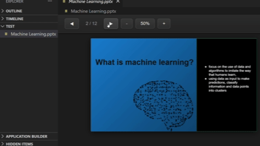

# Presentation Viewer

A Visual Studio Code extension that renders presentation files directly inside the editor.
All rendering is implemented through **custom JavaScript parsers**

No native bindings and no external office applications are required.

The extension reads the raw file, interprets its internal structure, and displays slides using HTML/CSS inside a VS Code webview.

  

# Supported formats

| Format                                         | Rendering Status       | Technical Notes                                                                                                                                                                                |
| ---------------------------------------------- | ---------------------- | -------------------------------------------------------------------------------------------------------------------------------------------------------------------------------------------------------------------- |
| **PPTX (.pptx/.pptm/.potx/.potm/.ppsx/.ppsm)** | **Mostly implemented** | Full ZIP parsing through JSZip. Text, images, shapes, basic backgrounds. Charts (EMF/WMF) and advanced grouping not handled.                                                                                         |
| **PPT (.ppt/.pps/.pot)**                       | **Partial**            | Parsed via CFB. Implementation handles text records and basic background detection. Images, drawings, tables, EMF/WMF graphics are not implemented.                                                                  |
| **ODP (.odp)**                                 | **Strong support**     | XML-based parsing. Text, images, tables and backgrounds implemented. Produces the most consistent results.                                                                                                           |
| **KEY (.key)**                                 | **Basic preview only** | Keynote APXL parser. Text, images and simple shapes. No proper layout engine (Keynote layout cannot be reconstructed reliably). Drawing operations, pinned geometries, and advanced vector elements are not handled. |

# Usage

1. Right-click a presentation file  
2. Choose **"Open with Presentation Viewer"**  
3. Use the toolbar:  
   - **◀ / ▶** to move between slides  
   - **Zoom buttons** to scale the slide  
   - **Slide counter** to jump around

# Features

### Core

* Custom parsing pipeline per format
* Renders slides using plain HTML/CSS (no canvas dependency
* All logic runs inside the webview; the extension host does not interpret slides

### Rendering capabilities

* **Text blocks** (paragraphs, runs, alignment, basic style attributes)
* **Images** (PNG/JPEG/SVG/TIFF detection through manual heuristics)
* **Tables** (ODP-only)
* **Simple shapes** (rectangles, ellipses, basic fills)
* **Background color / background image** where extractable

### Infrastructure

* No external rendering engines
* Internal fallback logic for unreadable or unsupported structures
* TIFF images auto-converted to PNG inside the webview when needed

# Limitations 

### PPTX

* EMF/WMF (charts, diagrams) are **not rendered**
* Grouped shapes are not decomposed correctly
* WordArt and complex vector paths are ignored

### PPT

* Only text-related records and some drawing containers are parsed
* No implementation for:
  * OfficeArt shape rendering
  * embedded image extraction
  * tables
  * charts
  * etc.

### ODP

* Layout engine is simplified; complex style inheritance may differ
* No animation, gradients may be approximated

### KEY

* APXL provides object definitions but no layout engine; positioning is approximate.
* Complex Keynote features (builds, connects, vector instructions) are not parsed
* Many shapes fall back to simple HTML placeholders

### Global

* Fonts are substituted by the browser
* No support for audio/video/animations/transitions
* Some files may contain unimplemented object types

### Feedback & Contributions

If the project helps you, give it a ⭐:
[repository](https://github.com/Klus3kk/vscode-slides-viewer)

Pull requests are always welcome!

Thank you :)

### Reporting Issues

If you find any problems or rendering errors you can report it here:
[issues](https://github.com/Klus3kk/vscode-slides-viewer/issues)

### License

This project is released under the MIT License.